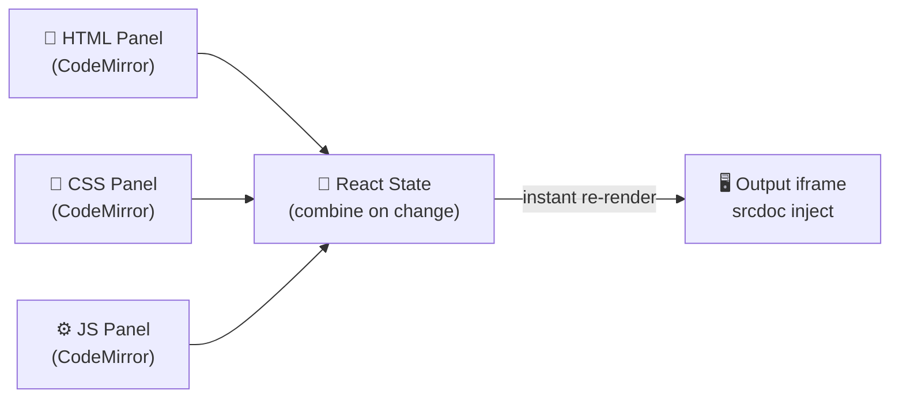

# 🖥️ Live Code Editor

A browser-based **Live Code Editor** built with **React** — write HTML, CSS, and JavaScript simultaneously and see your output render in real-time. Powered by **CodeMirror** for a professional editing experience.

🔗 **GitHub:** [biplab-430/Code-Editor](https://github.com/biplab-430/Code-Editor)

---

## ✨ What It Does

```
User opens editor
        ↓
Three panels appear — HTML | CSS | JS
        ↓
User types code in any panel
        ↓
Output iframe updates instantly (no button needed)
        ↓
Live preview renders the result in real-time 🚀
```

---

## 🎭 Features

### ✍️ Three-Panel Editor
- Dedicated editors for **HTML**, **CSS**, and **JavaScript**
- Each panel powered by **CodeMirror** — syntax highlighting, auto-indent, bracket matching
- Clean split-pane layout

### ⚡ Live Preview
- Output updates **instantly** as you type — no run button needed
- Rendered inside a sandboxed `<iframe>` — safe and isolated from the main app
- HTML, CSS, and JS are combined and injected on every change

### 🎨 Syntax Highlighting
- Language-aware highlighting per panel (HTML / CSS / JS)
- CodeMirror handles indentation, bracket matching, and code formatting automatically

---

## 🧰 Tech Stack

| Layer | Technology |
|---|---|
| Frontend | React.js |
| Code Editor | CodeMirror |
| Styling | CSS3 |
| Preview | HTML `<iframe>` sandbox |
| Deployment | — |

---

## 🔄 How Live Preview Works



The three editors are controlled React components — each keystroke updates state, which triggers a re-injection into the iframe's `srcDoc` attribute:

```javascript
const combinedOutput = `
  <html>
    <style>${css}</style>
    <body>${html}</body>
    <script>${js}</script>
  </html>
`;

<iframe srcDoc={combinedOutput} sandbox="allow-scripts" />
```

This is the same core technique used by tools like **CodePen** and **JSFiddle**.

---

## 📁 Project Structure

```
Code-Editor/
├── src/
│   ├── App.jsx           # Main layout — three editors + preview
│   ├── components/
│   │   ├── Editor.jsx    # CodeMirror wrapper component
│   │   └── Preview.jsx   # iframe output panel
│   └── index.css         # Global styles
├── public/
└── package.json
```

---

## 🚀 Getting Started

```bash
git clone https://github.com/biplab-430/Code-Editor.git
cd Code-Editor
npm install
npm start
```

Open [http://localhost:3000](http://localhost:3000) in your browser.

---

## 🧠 Interesting Implementation Detail

**Why `srcDoc` instead of `src`?**

Using `srcDoc` on the iframe lets us inject HTML as a string directly — no server, no blob URLs, no `document.write()`. The browser treats it as a fresh document every time state updates, giving a clean isolated render on each keystroke.

**Debouncing updates:**
To avoid re-rendering the iframe on every single keypress (which causes flicker), a small debounce delay is applied before injecting the new output — so the preview updates feel smooth rather than janky.

---

## 👨‍💻 Author

**Biplab Ghosh**  
B.E. Information Technology | University Institute of Technology, Burdwan  
📧 biplabg966@gmail.com  
🔗 [LinkedIn](https://linkedin.com/in/biplab-ghosh-71132a287) | [GitHub](https://github.com/biplab-430)
